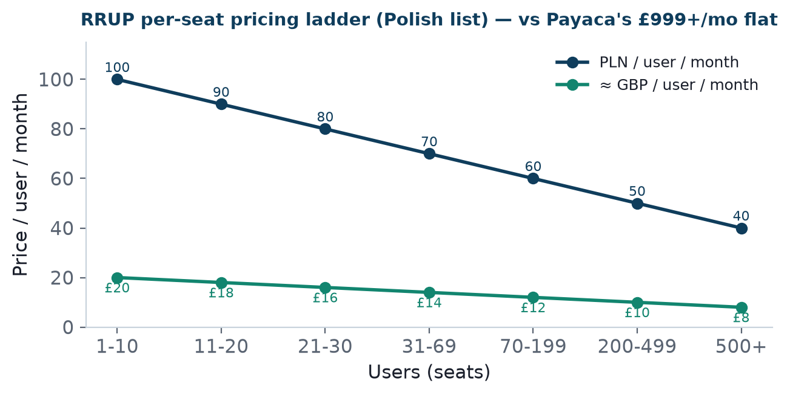

Bottom line up front 
RRUP prices <b>per seat</b> (≈£8–20/user/month on its Polish list); Payaca, the UK leader, prices <b>flat at £999–1,199/month</b> plus £1,500 onboarding. For a small installer (say 5–8 office/field users) a per-seat model can land well below Payaca — a genuine wedge for the price-sensitive small-installer segment. UK pricing is unset and is a CEO decision (do not quote it as fixed).

## 1. The RRUP pricing ladder ✅

<figure><figcaption>Exhibit 1: RRUP per-seat pricing ladder (Polish list, net of VAT; GBP approximate at 1 PLN ≈ £0.198).</figcaption></figure>

Per-seat pricing falls as seat count rises — from 100 zł (~£20) per user/month at 1–10 seats down to 40 zł (~£8) at 500+. This rewards larger deployments and gives a natural expansion-revenue path as a customer grows.

## 2. The competitive contrast ✅

| Vendor | Pricing model | Entry cost (illustrative small installer) |
|---|---|---|
| SalesOps CRM (per Polish list) | Per seat | ~£8–20 × seats — e.g. 6 seats ≈ £72–120/mo ⚠️ (UK price unset) |
| Payaca | Flat £999–1,199/mo + £1,500 onboarding | £999+/mo from day one |
| Reonic | Enterprise/quote (~$25k min projects reported) | High / opaque |

The wedge 
A newly-scaling installer with a handful of users faces ~£1,000/month + £1,500 upfront to adopt Payaca. A per-seat model priced even at a UK premium over the Polish list could plausibly enter at a fraction of that. For the <b>fastest-growing segment</b> — small, cost-conscious installers (Pack 06) — this is a real reason to switch, and the sharpest single commercial argument in the pitch.

## 3. The UK pricing decision ❓

Not yet set — a CEO decision 
The Polish list is a <b>reference, not a UK quote</b>. UK pricing must be set with RRUP. The recommendation for modelling (Pack 16) is a scenario band of the Polish list × {1.0, 1.3, 1.5} to reflect plausible UK uplift, all flagged as assumptions. Do not state a UK price as fixed to any prospect until RRUP confirms it.

## 4. Implication

Pricing is a strength to lead with **only if** UK pricing is set low enough to preserve the wedge while remaining margin-viable. The financial model (Pack 16) tests exactly this trade-off; the pricing decision should be an explicit, early agenda item with the CEO.

## Sources & confidence

| Claim | Source | Confidence |
|---|---|---|
| RRUP per-seat tiers | rrup.pl/cennik | ✅ Verified |
| Payaca £999–1,199/mo + £1,500 onboarding | payaca.com/pricing | ✅ Verified |
| Reonic ~$25k min | secondary report | 📊 Public (single source) |
| UK price | not set | ❓ CEO decision |
