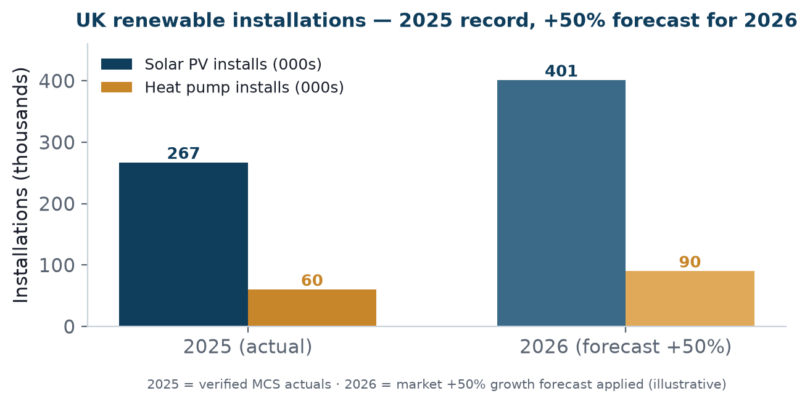

Bottom line up front 
The UK renewables-installer market is <b>small in absolute software spend but growing fast and structurally protected by government policy</b>. The installer base is large enough (5,250+ certified firms) and expanding quickly enough (+50% forecast for 2026) to support a focused, differentiated entrant — provided the entry is narrow and channel-led (Pack 06, Pack 08), not broad.

## 1. The market in numbers ✅📊

5,250+

MCS-certified installers

267k

Solar installs (2025)

~£262m

UK FSM software market (2026)

<figure><figcaption>Exhibit 1: UK renewable installations — 2025 verified actuals and 2026 growth forecast.</figcaption></figure>

| Metric | Value | Confidence |
|---|---|---|
| MCS-certified installers (all tech) | 5,250+ (highest since 2008) | ✅ |
| MCS solar PV installers | 4,000+ | ✅ |
| Solar PV installs, 2025 | 267,032 (+31%, a record) | ✅ |
| Heat pump installs, 2025 | 60,000+ (single-year record) | ✅ |
| Cumulative heat pump installs | 250,000+ (Feb 2026) | ✅ |
| 2026 growth forecast | +50% YoY | 📊 |
| UK field-service-management software market | ~USD 234m (2025) → ~USD 262m (2026); CAGR ~9–16% | 📊 |

## 2. Why the market exists — and why now

The demand is not speculative; it is policy-manufactured. Three structural forces make installer businesses scale, and scaling is precisely when they outgrow spreadsheets and buy software:

- **Boiler Upgrade Scheme** — up to £7,500 off a heat pump, pulling demand forward. ✅
- **0% VAT on solar** — through March 2027, improving installer economics. ✅
- **Government target** — 600,000 heat pumps per year by **2028** (a 10× ramp from current run-rate). ✅

The demand-to-CRM link 
More installs → more jobs, more compliance paperwork (MCS/DNO/ECO4), more subcontractor coordination, more commission to calculate. Every one of those is a CRM/workflow pain. The market isn't just growing — it's growing in a way that <b>directly manufactures demand for exactly what SalesOps CRM does</b>.

## 3. The honest counterweight

The absolute software market is modest (~£200m order of magnitude, USD) and already contested (Pack 04). This is a **focused niche play, not a land-grab**. Success depends on winning a defensible share of a specific segment (Pack 06), not on the market's size alone. Entry economics must reflect that discipline (Pack 16).

## 4. Implication

The market clears the "is it real and growing" test decisively. The binding questions move downstream: *which segment first* (Pack 06), *how to reach them cheaply* (Pack 08), and *how to differentiate against Payaca/Reonic* (Pack 04).

## Sources & confidence

| Claim | Source | Confidence |
|---|---|---|
| Installer counts, install volumes | MCS / Segen / UKEM | ✅ Verified |
| +50% 2026 forecast | industry coverage | 📊 Public |
| Policy incentives (BUS, VAT, 2028 target) | gov.uk | ✅ Verified |
| UK FSM software market size | Expert Market Research et al. | 📊 Public |
