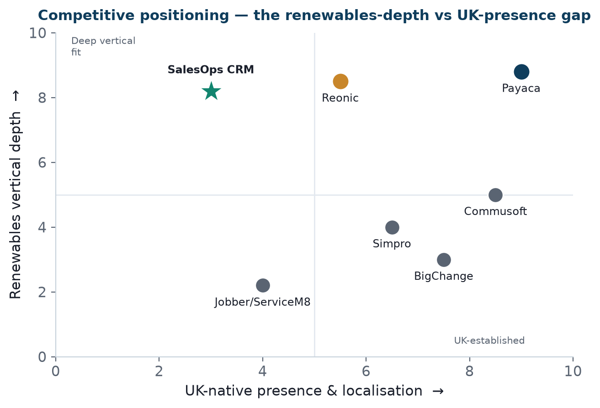

Bottom line up front 
A Five Forces read shows a market that is <b>contested but not closed</b>: a UK-native leader (Payaca) and a well-funded EU entrant (Reonic) already occupy the renewables niche, but switching costs are moderate and differentiation is possible on price model and cross-vertical breadth. This is a viable third-entrant market — provided the wedge is real and demo-proven, not asserted.

## Porter's Five Forces

<figure><figcaption>Exhibit 1: Competitive positioning — renewables vertical depth vs UK-native presence.</figcaption></figure>

| Force | Assessment | Intensity |
|---|---|---|
| **Competitive rivalry** | Payaca (UK-native leader) + Reonic (German, €13M-funded, entering UK) directly contest the renewables niche; several general trade-CRMs at the edges | High |
| **Threat of new entrants** | Reonic proves the EU-to-UK entry path is live; low regulatory barrier to software entry, but brand/reference barriers are real | Medium–High |
| **Buyer power** | Installers are cost-conscious; free trials and low switching-in cost raise buyer leverage; but incumbents' onboarding fees create lock-in once adopted | Medium |
| **Supplier power** | The "supplier" is RRUP (the platform). Terms with RRUP directly shape viability — the deal-structure question (Pack 14) is effectively supplier power | Medium (deal-dependent) |
| **Substitutes** | Spreadsheets + WhatsApp + generic CRM (the status quo most small installers still run) is the biggest real competitor | High |

## The most important force: the status quo

The real competitor is "nothing" 
For the target small-installer segment, the incumbent isn't Payaca — it's <b>spreadsheets and WhatsApp</b>. That's good news (a large un-penetrated base) and a challenge (you must sell the category, not just beat a rival). The pitch (Pack 09) therefore leads with the cost of the status quo — the "leaky bucket" — before competitor comparison.

## Where the entry wedge sits

1. **Price model** — per-seat vs Payaca's £999+/mo flat (Pack 02) — real for small installers.
2. **Cross-vertical breadth** — solar + heat pump + more in one system (Pack 02).
3. **Proven platform** — 600+ deployments neutralises the "unproven newcomer" objection.

Each must be **demo-verified** before it's claimed head-to-head (Pack 20).

## Implication

The market is attractive enough to enter and structured such that a differentiated third player can win share — but only against the status quo primarily, and the incumbents secondarily, with a wedge that survives contact with a live demo.

## Sources & confidence

| Claim | Source | Confidence |
|---|---|---|
| Payaca, Reonic, general trade-CRM set | vendor sites / search | ✅ Verified |
| Reonic funding (€13M) | TechCrunch/Dealroom | ✅ Verified |
| Buyer/substitute dynamics | analysis | 📊 Reasoned |
