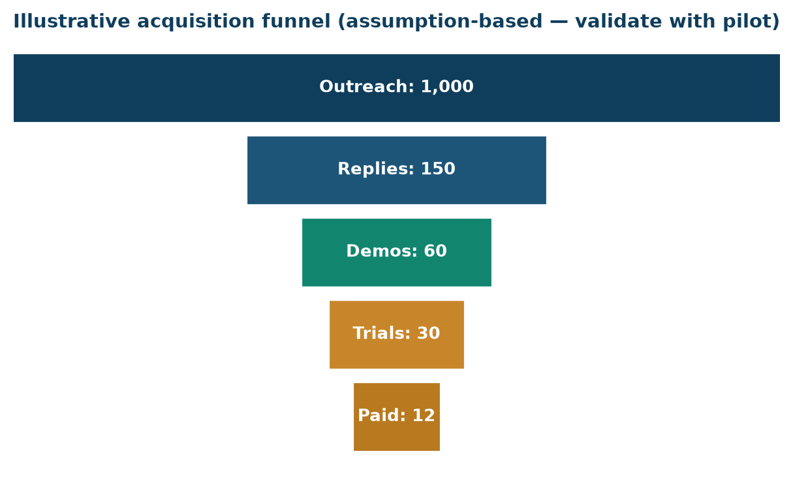

Bottom line up front 
The funnel below is an <b>illustrative model, not a forecast</b> — every conversion rate is a flagged assumption to replace with real pilot data. Its purpose is to make the arithmetic honest: how many outreaches must go in the top to yield paying customers, and therefore what one SDR can realistically produce.

## The illustrative funnel ⚠️

<figure><figcaption>Exhibit 1: Illustrative acquisition funnel — assumption-based, to be validated by the pilot.</figcaption></figure>

| Stage | Illustrative rate | From 1,000 outreaches |
|---|---|---|
| Outreaches | — | 1,000 |
| Replies / conversations | 15% ⚠️ | 150 |
| Demos booked & held | 40% of replies ⚠️ | 60 |
| Free trials started | 50% of demos ⚠️ | 30 |
| Trial → paid | 40% of trials ⚠️ | 12 |

These numbers are placeholders 
The rates above are round, conservative illustrations to show the <b>shape</b> of the funnel. The first ~90 days of real outreach replace every one of them. The trial→paid rate in particular depends heavily on the 30-day onboarding (Pack 12), which is why that process is treated as a core retention asset, not an afterthought.

## What the maths implies

- To land ~12 customers, the model implies ~1,000 quality outreaches — a quarter's work for one focused SDR at ~40–60/day (Pack 13).
- Small improvements in the **demo→trial** and **trial→paid** steps move revenue far more than raw outreach volume — so onboarding quality and demo skill are the highest-leverage investments.

## Reconciliation

These conversion assumptions feed directly into the financial model (Pack 16) and the GTM viability simulation (Pack 5A / _SIMULATION). Any inconsistency between this funnel and the revenue model is reconciled there, not averaged over.

## Sources & confidence

| Input | Source | Confidence |
|---|---|---|
| Conversion rates | illustrative | ⚠️ Assumption — validate |
| SDR capacity (40–60/day) | Pack 13 | 📊 Benchmark |
