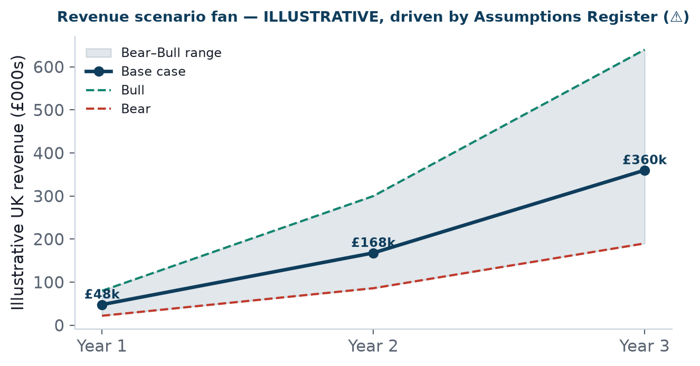

Bottom line up front 
The org grows in three steps, each gated on proof: <b>founder-only</b> → <b>lean pod</b> (SDR + AE + Implementation lead) → <b>regional team</b>. Hiring follows demonstrated traction (Pack 05 gates), never precedes it — the discipline that keeps a loan-funded venture solvent.

<figure><figcaption>Exhibit 1: Revenue scenarios (context for when hiring is affordable) — from the Assumptions Register.</figcaption></figure>

## The three org stages

| Stage | Team | Trigger |
|---|---|---|
| **Founder-only** | You (all functions, Pack 11) | Launch |
| **Lean pod** | + Outbound SDR, Vertical AE, Implementation lead | Repeatable motion + funding (Pack 05/16) |
| **Regional team** | + more sellers, regional coverage | Positive unit economics; Tier-2/3 expansion (Pack 06) |

The lean-pod logic 
The three pod roles map exactly to the three functions that make the motion work: generate pipeline (SDR), convert it (AE), and retain it (Implementation). It's the smallest team that covers the whole motion without gaps — and each role only gets hired when the founder can no longer cover it and the revenue supports it.

## Implication

This staged org is the backbone of the staffing forecast (this Pack) and the cost side of the financial model (Pack 16). Its discipline — proof before headcount — is a core risk mitigation (Pack 19).

## Sources & confidence

| Claim | Source | Confidence |
|---|---|---|
| Org stages | Pack 05/11 | 📊 Reasoned |
| Hire costs | Pack 08 benchmarks | 📊 Public / ⚠️ |
