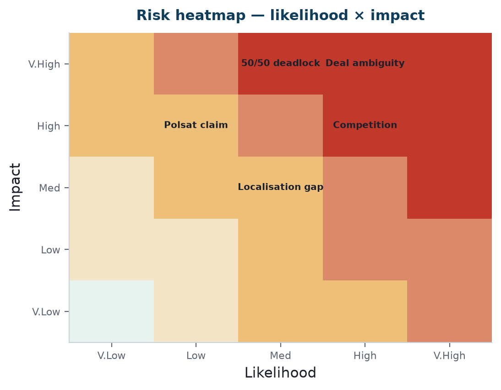

Bottom line up front 
The venture's top risks are known and mostly controllable: <b>deal-structure ambiguity</b>, an <b>unverified client claim</b>, <b>well-funded competition</b>, and the classic <b>50/50 deadlock</b>. None is a reason not to proceed; each has a named mitigation and a clear owner. Surfacing them proactively is itself a mark of the plan's seriousness.

<figure><figcaption>Exhibit 1: Risk heatmap — likelihood × impact for the principal named risks.</figcaption></figure>

## Master register

| # | Risk | L×I | Mitigation | Owner |
|---|---|---|---|---|
| 1 | Deal-structure stays ambiguous | High | Resolve via Pack 22 Q1 before signing/capital | You + CEO |
| 2 | Polsat claim used before verified | Med×High | Do not use until confirmed (Pack 02, Q6) | You |
| 3 | Bart-style misrepresentation recurs | Med×High | Everything in writing; verify claims (this package's discipline) | You |
| 4 | Competition (Payaca/Reonic) | High×Med | Focus segment, price wedge, speed (Pack 04) | You |
| 5 | 50/50 deadlock (if equity JV) | Med×High | Deadlock clause before signing (Pack 14) | You + solicitor |
| 6 | UK localisation gap | Med×Med | Confirm with RRUP (Q7); demo-verify (Pack 20) | You + RRUP |
| 7 | Demo/trial instance unreliable | Med×Med | Confirm live before every pitch; UAT fallback | You |
| 8 | Funding mismatch to deal | Med×Med | Revisit Pack 16 after Q1 answered | You |
| 9 | Policy reversal (grants/VAT) | Low×High | Bear-case model (Pack 16); don't assume subsidy forever | You |
| 10 | UK GDPR non-compliance | Low×High | ICO registration + DPA at formation (Pack 15) | You + solicitor |

## The four detailed risk categories follow

Commercial, Operational, Compliance and Partnership risks are each expanded in their own document in this Pack, with deeper mitigations.

## Implication

This register is reviewed at every milestone (post-CEO answers, first demo, first customer) and updated as risks change. It is a living control, not a one-off.

## Sources & confidence

| Claim | Source | Confidence |
|---|---|---|
| Risk identification | analysis across Packs | 📊 Reasoned |
| Ratings | judgement | ⚠️ Review periodically |
